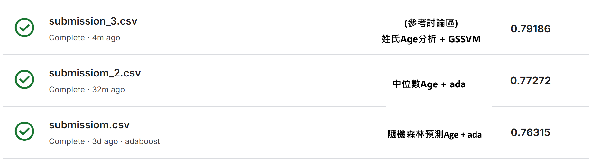

# IMLP425
This is NTUTRAIN IMLP course.

| 作業期數 | 連結 |
|---|---|
| 作業1 | [Unit1_Crash Course on Python](https://github.com/EasyBoy5566/IMLP425/blob/main/Unit01_Crash%20Course%20on%20Python.ipynb) |
| 作業2 | [Unit2_01_NumPy和陣列導向的程式設計](https://github.com/EasyBoy5566/IMLP425/blob/main/Unit02/01_NumPy%E5%92%8C%E9%99%A3%E5%88%97%E5%B0%8E%E5%90%91%E7%9A%84%E7%A8%8B%E5%BC%8F%E8%A8%AD%E8%A8%88.ipynb) [Unit2_2_Pandas數據分析](https://github.com/EasyBoy5566/IMLP425/blob/main/Unit02/02_Pandas%E6%95%B8%E6%93%9A%E5%88%86%E6%9E%90.ipynb) [Unit2_03_Matplotlib資料視覺化](https://github.com/EasyBoy5566/IMLP425/blob/main/Unit02/03_Matplotlib%E8%B3%87%E6%96%99%E8%A6%96%E8%A6%BA%E5%8C%96.ipynb)|
| 作業3 |[Unit3_4_Categorical_features_實戰](https://github.com/EasyBoy5566/IMLP425/blob/main/Unit03/4_Categorical_features_%E5%AF%A6%E6%88%B0.ipynb) [Unit3_5_Prepocessing_實戰](https://github.com/EasyBoy5566/IMLP425/blob/main/Unit03/5_Prepocessing_%E5%AF%A6%E6%88%B0.ipynb) [Unit3_6_scikit_learn_Basic_實戰](https://github.com/EasyBoy5566/IMLP425/blob/main/Unit03/6_scikit_learn_Basic_%E5%AF%A6%E6%88%B0.ipynb)|
| 作業4 | [Unit4_Linear Regression_HW](https://github.com/EasyBoy5566/IMLP425/blob/main/Unit04/Linear%20Regression_HW.ipynb)|
| 作業5 | [Unit5_Logistic regression實戰](https://github.com/EasyBoy5566/IMLP425/blob/main/Unit05/02_Logistic%20regression%E5%AF%A6%E6%88%B0.ipynb) [Unit5.2_SVM實戰](https://github.com/EasyBoy5566/IMLP425/blob/main/Unit05_2/SVM%E5%AF%A6%E6%88%B0.ipynb)|
| 作業6 | [Unit6_1.3_ConfusionMatrix_實戰](https://github.com/EasyBoy5566/IMLP425/blob/main/Unit06/1.3_ConfusionMatrix_%E5%AF%A6%E6%88%B0.ipynb) [Unit6_2.3_Ensemble實戰](https://github.com/EasyBoy5566/IMLP425/blob/main/Unit06/2.3_Ensemble%E5%AF%A6%E6%88%B0.ipynb) |
| 小專案 | |

